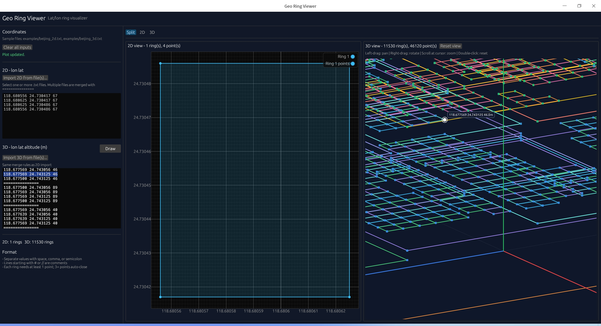

# Geo Ring Viewer

Desktop tool to visualize 2D/3D latitude/longitude rings. Coordinates can be typed in the UI or **imported from text files**.



## AI and authorship

This project idea, feature direction, and product goals are mine.
I used AI coding assistance to help generate and polish parts of the implementation and documentation.

If you use this project, please treat it as a practical prototype built from a human-defined idea with AI-assisted development.

## Run

```bash
cargo run --release
```

## Package for colleagues

```bash
chmod +x package.sh
./package.sh
```

Output: `dist/geo-ring-viewer-<version>-linux-<arch>.tar.gz` — send this archive. See [DISTRIBUTE.md](DISTRIBUTE.md) for details.

## Sample data files

Example coordinate files live in the project folder:

- `examples/beijing_2d.txt` — 2D rings (lon lat per line)
- `examples/beijing_3d.txt` — 3D rings (lon lat altitude per line)

In the app, use **Import 2D from file(s)...** or **Import 3D from file(s)...** and pick these files (the file dialog opens in `examples/` when possible).

## Import behavior

| Selection | Result |
|-----------|--------|
| **One file** | File contents replace the input area |
| **Multiple files** | Each file becomes one block; blocks are joined with `===============` (same as rings inside a file) |

After import, click **Draw** if the plot does not update automatically (import also parses and refreshes the view).

## Coordinate format

```
116.391 39.907
116.450 39.920

===============

116.300 39.800
116.350 39.850
```

- **2D**: `lon lat` per line
- **3D**: `lon lat altitude_m` per line
- **`===============`**: separates rings (in one file or between merged files)
- **`#` or `//`**: comments

## Views

- **2D**: scroll to zoom, drag to pan, double-click to reset zoom
- **3D**: left-drag pan, right-drag rotate, scroll at cursor to zoom, click a point to show lon/lat/altitude, double-click to reset view
